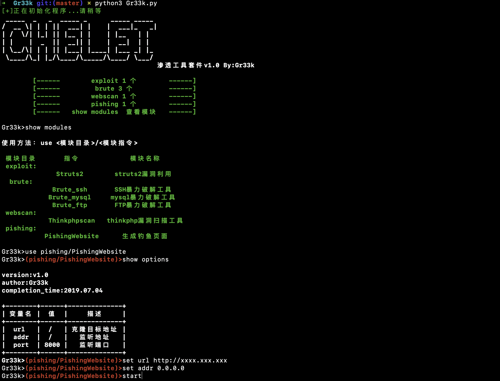

# chelei-framework
一个定制自己渗透测试的python框架(推荐在linux或mac下使用，win请自行对路径进行修改)

# 提示
本框架只是提供了一个自己制作渗透工具集的一个思路，希望大家能使用它打造最合适自己的渗透工具，其中的攻击payload我不会再做增加，这个就是收集的事，希望大家动手去集成自己想要的功能。  
若需要带有攻击payload的渗透测试工具，请访问<https://github.com/lijiaxing1997/Gr33k.git>  
本工具没有进行全方位的测试，如遇到闪退或者报错bug，请联系<jiaxingl@126.com>


# 使用方法：
python3 Gr33k.py
- show modules  打印可用模块
- use module_name 选择模块
- show options  打印模块选项
- set var_name var_value  设置变量值
- start  开始执行
- back  退出模块
- exit  退出程序

# 攻击截图如下


# 框架介绍
### 安装
```sh
git clone https://github.com/lijiaxing1997/chelei-framework.git
cd chelei-framework
pip3 install -r requirements.txt -i https://mirrors.aliyun.com/pypi/simple/
```
### 目录结构
- Gr33k.py 是框架入口主文件
- lib 该目录存放框架所调用的模块，包括后续自己去集成的模块，都直接放进对应目录即可
- dict 该目录存放了常用的字典，我懒，没收集
- init_module.py 初始化模块使用
- key_log 该目录存放钓鱼页面调取的按键记录
- temp 临时文件夹，存放加载的序列化模块

# 如何集成模块
模块的集成十分简单，只需要按格式编写python代码，就可以被框架调用。lib下文件夹代表模块类型，现有的类型有brute、exploit、scan、pishing。模块类型文件夹中就是存放的各个模块。PishingWebsite.py为例，讲解模块的集成方式

#### py文件命名与py文件内的类名相同

```sh
PishingWebsite.py --> class PishingWebsite(Base_module)
```
#### 必须继承Base_module类，并且__init__函数规范书写

```py
    def __init__(self):
        options = [
            ['url', '/', '克隆目标地址'],
            ['addr', '/', '监听地址'],
            ['port', '8000', '监听端口'],
        ]

        moudle_description = {
            'version': 'v1.0',
            'author': 'Gr33k',
            'completion_time': '2019.07.04',
            'name': '生成钓鱼页面',
        }
        super().__init__(moudle_description,options)
        self.version = moudle_description['version']
        self.author = moudle_description['author']
        self.completion_time = moudle_description['completion_time']
        self.name = moudle_description['name']
        self.options = super().return_options(options)
        self.variables = super().return_variables(options)
```
- options这个列表中存储的就是用户需要输入的变量，用户通过set value_name value_value来对对应变量进行设置，格式为:[变量名，默认变量值，变量说明]。
- moudle_description存储了模块的基本说明，对应修改就可以。
- 下面的初始化代码不需要改动
- 重写start()方法，用户在程序中通过start来调用模块的start()方法，从而开始执行模块
- 其余函数自行发挥，反正最后start()为模块执行入口.
